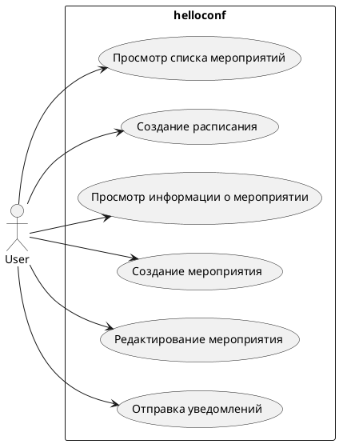

# Описание требований и архитектуры

## Введение
<!-- Общее краткое описание создаваемой системы -->
В рамках курса осуществляется проектирование решения на основе [постановки задачи от "заказчика"](../../task.md).

- [Описание требований и архитектуры](#описание-требований-и-архитектуры)
  - [Введение](#введение)
  - [Заинтересованные стороны](#заинтересованные-стороны)
  - [Бизнес-контекст (бизнес-требования)](#бизнес-контекст-бизнес-требования)
  - [Глоссарий](#глоссарий)
  - [Модель предметной области](#модель-предметной-области)
  - [Требования к системе](#требования-к-системе)
    - [Сценарии использования (Use case)](#сценарии-использования-use-case)
    - [Функциональные требования](#функциональные-требования)
    - [Нефункциональные требования/Требования к атрибутам качества](#нефункциональные-требованиятребования-к-атрибутам-качества)
    - [Ограничения](#ограничения)
  - [Архитектура](#архитектура)
    - [Журнал архитектурных решений](#журнал-архитектурных-решений)
    - [Контекст решения](#контекст-решения)
    - [Компонентная архитектура](#компонентная-архитектура)
    - [Реализация сценариев использования](#реализация-сценариев-использования)
    - [Программные интерфейсы](#программные-интерфейсы)
    - [Схема развертывания](#схема-развертывания)
  
## Заинтересованные стороны
<!-- Перечень заинтересованных сторон и их интересов по отношению к создаваемой системе. 
Подробнее: https://confluence.mts.ru/pages/viewpage.action?pageId=399975538 
-->
| Заинтересованная сторона | Интересы           |
|:-------------------------|:-------------------|
| *Организаторы мероприятий*| *Автоматизация процессов организации мероприятий* |
| *Докладчики* | *Подача заявок на участие, доступ к организационной информации, обратная связь* |
| *Слушатели*| *Доступ к организационной информации, подача заявок на посещение мероприятий* |
| *Подрядные организации*| *Предложение услуг по техническому обслуживанию мероприятий* |
| *Арендодатели*| *Предложения площадок для проведения мероприятий* |
| *Финансовый директор*| *Повышение прибыли компании* |
| *Юридический отдел*| *Юридическое сопровождение организации мероприятий* |

## Бизнес-контекст (бизнес-требования)

<!-- Общее описание бизнес-контекста создаваемой системы (автоматизируемой деятельности), список бизнес-целей заинтересованных сторон 
Подробнее: https://confluence.mts.ru/pages/viewpage.action?pageId=399973845
-->
## Текущее состояние (AS IS)
В настоящее время организаторы мероприятий проводят исследования целевой аудитории, определяют формат и цели мероприятия. Производится поиск места для проведения мероприятия-закладываются перспективные варианты на основе ранее проведенных мероприятий и далее происходит связь с арендодателями. Организаторы мероприятий размещают вручную объявления и посты на площадках, где происходят активности у потенциально-заинтересованных лиц, далее по результатам обратной связи от потенциальных докладчиков-формируется программа мероприятия. Далее организаторы вручную размещают объявления и пригласительные посты для привлечения участников (слушателей) мероприятий. Далее происходит поиск подрядной организации для обеспечения технического сопровождения мероприятия-свет, звук, организация стендов...Для привлечения внешних финансов обеспечивается поиск и связь со спонсорами.
## Цели и задачи
Согласно текущему состоянию бизнес-процессов организации мероприятий определяются следующие цели и задачи для каждой заинтересованной стороны:
**Для организаторов мероприятия:**

 - Успешная организация мероприятия с высокой посещаемостью и интересом участников, что может привести к повышению репутации организаторов и привлечению новых потенциальных клиентов.
 - Максимально эффективная и точная идентификация целевой аудитории, чтобы организаторы могли определить наиболее подходящий формат мероприятия, а также привлечь наиболее подходящих докладчиков и спонсоров.
 - Повышение доходов, которые могут быть получены за счет продажи билетов, участия спонсоров, продажи рекламы и других доходов.

**Для докладчиков:**

 - Возможность представить свою работу и получить обратную связь от профессионального сообщества, что может привести к увеличению репутации и привлечению новых клиентов.
 - Увеличение видимости и узнаваемости в отрасли.
 - Получение возможности общаться с другими экспертами и налаживание новых связей, что может привести к новым возможностям и развитию карьеры.

**Для спонсоров**

 - Увеличение узнаваемости и репутации бренда, что может привести к привлечению новых клиентов и улучшению продаж.
 - Получение доступа к целевой аудитории, которая может быть заинтересована в продукции бренда.

**Для участников мероприятия**

 - Получение новых знаний и навыков в интересующей их области
 - Установление контактов и обмен опытом с другими участниками мероприятия

**Для подрядных организаций**

 - Получение прибыли от оказания услуг по техническому сопровождению мероприятия
 - Расширение своей клиентской базы и установление новых деловых контактов

По совокупности целей, определенных выше: для организаторов мероприятия - разработка приложения helloconf должна повысить прибыль, извлекаемую из проведения мероприятия и взаимодействия со спонсорами и сократить издержки на проведение мероприятий путем демпфирования стоимости услуг технического сопровождения. Привлечение новых спонсоров должно повысить экономическую выгоду. Ожидаемая прибыль по сравнению с текущей должна быть увеличена на 35% за второе полугодие 2023г. 

## Целевое состояние (TO BE)
Организаторы конференции размещают в приложении helloconf описание предстоящего меропрития, выбирают шаблон дизайна под мероприятие. По заданным в приложении каналам связи анонс конференции размещается в социальных сетях, платформах, мессенджерах. Приложение агрегирует обратную связь от потенциальных докладчиков. Далее операторами приложения производится отбор докладчиков и формируется программа конференции. С помощью выбранного бизнес-шаблона в приложении формируется афиша конференции и афиша размещается по необходимым каналам связи для подрядных организаций, спонсоров, арендодателей. Далее в приложении появляются предложения об услугах подрядных организаций, арендодателей. По бизнес-каналам поступает информация от спонсоров. Операторы приложения выбирают наиболее экономически-выгодные предложения по аренде и предложению услуг, договариваются о взаимодействии со спонсорами. Далее афиша со скорректированными датами и расписанием размещается по каналам связи для привлечения участников конференции. Участникам рассылаются приглашения на офлайн посещение и онлайн-трансляцию.
## Глоссарий
<!-- Содержит основные понятия и термины предметной области  
Подробнее: https://confluence.mts.ru/pages/viewpage.action?pageId=375782595
-->
| Понятие                        | Сокращение                         | Определение                       |
|:-------------------------------|:-----------------------------------|:----------------------------------|
| *Арендодатель* | *-* | *физическое или юридическое лицо, которое сдаёт в аренду своё имущество* |
| *Билет* | *-* | *документ, удостоверяющий право посетить определенное мероприятие* |
| *Докладчик* | *-* | *участник мероприятия, который представляет свой опыт или знания на тему, связанную с мероприятием* |
| *Конференция* | *-* | *мероприятие, организованное для обмена знаниями, опытом и идеями между участниками* |
| *Мероприятие* | *-* | *событие, проводимое с определенными целями и задачами* |
| *Организатор* | *-* | *лицо или компания, ответственные за планирование и проведение мероприятия.* |
| *Приглашение* | *-* | *документ, уведомляющий получателя о возможности посетить определенное мероприятие, организованное отправителем* |
| *Расписание* | *-* | *документ, в котором указаны дата и время проведения мероприятий, а также место их проведения* |
| *Слушатель* | *-* | *участник мероприятия, который приходит для получения знаний и опыта, представленных докладчиками* |
| *Специалист* | *-* | *специалист, обладающий определенными знаниями и навыками в области техники и технологий, который может помочь в организации и проведении мероприятия* |
| *Спонсор* | *-* | *компания или организация, которая предоставляет финансовую поддержку для проведения мероприятия* |

## [Модель предметной области](data/data.md)

## Требования к системе

### Сценарии использования (Use case)
<!-- Подробное описание сценариев использования системы с привязкой к ролям участников и задействованным бизнес-сущностям 
https://confluence.mts.ru/pages/viewpage.action?pageId=375782108 
https://confluence.mts.ru/pages/viewpage.action?pageId=375782119 
-->
#### Диаграмма сценариев использования (Use Case Diagram) <!-- omit in toc -->

#### Список сценариев использования <!-- omit in toc -->

| ID     | Описание                                          |
|--------|---------------------------------------------------|
| UC.001 | *[Создание мероприятия](uc/uc.001.md)* |
| UC.002 | *[Редактирование мероприятия](uc/uc.002.md)* |
| UC.003 | *[Просмотр информации о мероприятии](uc/uc.003.md)* |
| UC.004 | *[Просмотр списка мероприятий](uc/uc.004.md)* |
| UC.005 | *[Создание расписания](uc/uc.005.md)* |
| UC.006 | *[Отправка уведомлений](uc/uc.006.md)* |

### Функциональные требования
<!-- Описание требований к функциям, реализуемым системой. Требование может быть привязано к сценарию использования или быть общим 
Подробнее: https://confluence.mts.ru/pages/viewpage.action?pageId=375782501 
-->
| ID     | Функциональное требование             |
|--------|---------------------------------------|
| FR.001 | *Система должна обеспечивать возможность просматривать список всех мероприятий, которые доступны в системе* |
| FR.002 | *Система должна обеспечивать возможность создавать расписание мероприятия с указанием времени начала и конца, места проведения* |
| FR.003 | *Система должна обеспечивать возможность создания мероприятия с указанием места проведения и времени* |
| FR.004 | *Система должна обеспечивать возможность просматривать подробную информацию о мероприятии, включая его название, дату проведения, место проведения, описание, категорию мероприятия, список участников и другие детали* |
| FR.005 | *Система должна обеспечивать редактирования данных мероприятии* |
| FR.006 | *Система должна обеспечивать возможность общения с участниками мероприятия путем отправки уведомлений, ответов на вопросы* |

### Бизнес метрики
Для сервиса helloconf определены следующие бизнес-метрики и нефункциональные требования.
| Бизнес метрика     | Нефункциональные требования             |
|--------|------------------------------|
| Количество зарегистрированных пользователей = 3000 за 1 месяц | Приложение hellocnf должно быть доступно для пользователей 24/7, с минимальным временем простоя не более 20 минут в месяц |
| Количество проданных билетов = 100 в 1 час | Приложение hellocnf должно обеспечивать быстрый и отзывчивый интерфейс, с максимальным временем отклика на любое действие пользователя не более 3 секунд. |
| Количество оценок пользователей о сервисе = 90% "отлично"  | Приложение hellocnf должно обеспечивать быструю и качественную техническую поддержку для пользователей, с обязательным отслеживанием и решением всех заявок в течение 24 часов |
| Количество активных пользователей (DAU) = 1000 за день, в пике 8000 DAU  | Приложение hellocnf должно обеспечивать работу без отказов при нагрузке 3000 DAU, в пике 10000 DAU|
| Общая конверсия не менее 30%| Приложение helloconf должно обеспечивать удобный интерфейс, поддерживающий английский и русский языки|

### Требования к атрибутам качества
<!-- Требования к основным архитектурным характеристикам (атрибутам качества) системы - надежность, масштабируемость, ИБ, и др.
Подробнее: https://confluence.mts.ru/pages/viewpage.action?pageId=375782530
-->
| ID     | Атрибут качества             | Описание требования                       |
|--------|------------------------------|-------------------------------------------|
| QR.001 | *Доступность* | *Для обеспечения доступности приложения helloconf в соответствии с нефункциональным требованием требуется обеспечить значение доступности в 99,95%. Расчет показателя производится по формуле Доступность = (Время доступности / (Время доступности + Время недоступности)) * 100%* |
| QR.002 | *Надежность* | *приложение должно быть способным обрабатывать большое количество запросов и пользователей без отказов. В соответствии с нефункциональным требованием для 3000 DAU надежность должна составлять = ~7%. Для 10000 DAU в пике = ~75%. Расчет надежности производится по формуле Надежность = (Кол-во времени безотказной работы / Общее время работы) * 100%* |

#### Мониторинг атрибутов качества
| ID     | Атрибут качества             |Алгоритм/способ мониторинга                       |
|--------|------------------------------|-------------------------------------------|
| QR.001 | *Доступность* | *сбор метрик системы, журналирование событий* |
| QR.002 | *Надежность | *автоматизированные тесты, сбор обратной связи от клиентов* |

### Ограничения
<!-- Описываются ограничения, оказывающие влияние на архитектуру системы - временные, финансовые, технологические
Подробнее: https://confluence.mts.ru/pages/viewpage.action?pageId=375782592
-->
| ID     | Ограничение            |
|--------|------------------------|
| AC.001 | *система должна быть разработана и запущена в первом квартале 2024 г.* |
| AC.002 | *бюджет проекта ограничен RMS01* |
| AC.003 | *система должна обеспечивать уровень безопасности для защиты персональных данных пользователей в соответствии с 152ФЗ* |
| AC.004 | *система должна использовать библиотеки для разработки программного обеспечения согласно списку №1 от Министерства самых перспективных технологий* |
| AC.005 | *система должна быть локализована по стандартам РФ* |

Исходя из основных функциональностей приложения helloconf предлагается отнести приложение к категории систем BASE. Приложение в первую очередь должно обеспечивать высокий показатель доступности (QR.001 99,95%). BASE подход обеспечивает высокую доступность системы, что является важным критерием для пользователей приложения.

## Архитектура

### Журнал архитектурных решений
<!-- Записи о ключевых принятых архитектурных решениях (ADR) для реализации архитектурно-значимых требований.
Подробнее: https://confluence.mts.ru/pages/viewpage.action?pageId=421162308
-->
- [ADR.001 выбор категории системы](adr/ADR_1_category.md)
- [ADR.002 выбор шаблона интеграции](adr/ADR_2_template.md)
- [ADR.003 выбор mongoDB](adr/ADR_3_mongoDB.md)

### [Контекст решения](context/context.md)

### [Компонентная архитектура](components/components.md)

### Реализация сценариев использования
<!-- Реализация сценариев использования на основе взаимодействия компонентов системы и внешних систем/участников.
Диаграммы последовательности (UML Sequence diagram) и текстовое описание.

Подробнее: 
https://confluence.mts.ru/pages/viewpage.action?pageId=399442132
https://confluence.mts.ru/pages/viewpage.action?pageId=399442170
-->
| ID     | Описание                          | Реализация                                    |
|--------|-----------------------------------|-----------------------------------------------|
| UC.001 | *Название сценария использования* | [Реализация сценария](uc-impl/uc.001-impl.md) |

### Программные интерфейсы
<!-- Спецификации публичных API системы и ее компонентов (синхронных, событийных). Создается на основе модели предметной области для реализации сценариев использования. 
  Форматы: OAS/Swagger, GraphQL, AsyncAPI/CloudEvents
-->
| Компонент             | Интерфейс                                      |
|:----------------------|:-----------------------------------------------|
| *Название компонента* | *[Название интерфейса](api/service-name.yaml)* |

### [Схема развертывания](deployment/deployment.md)
